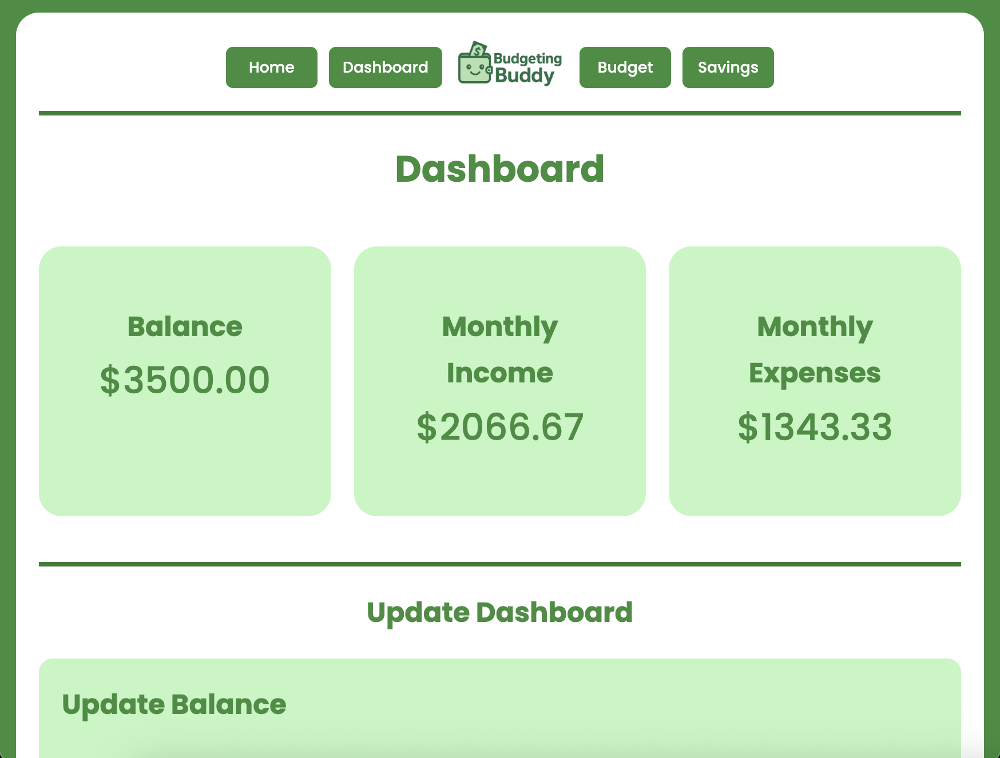
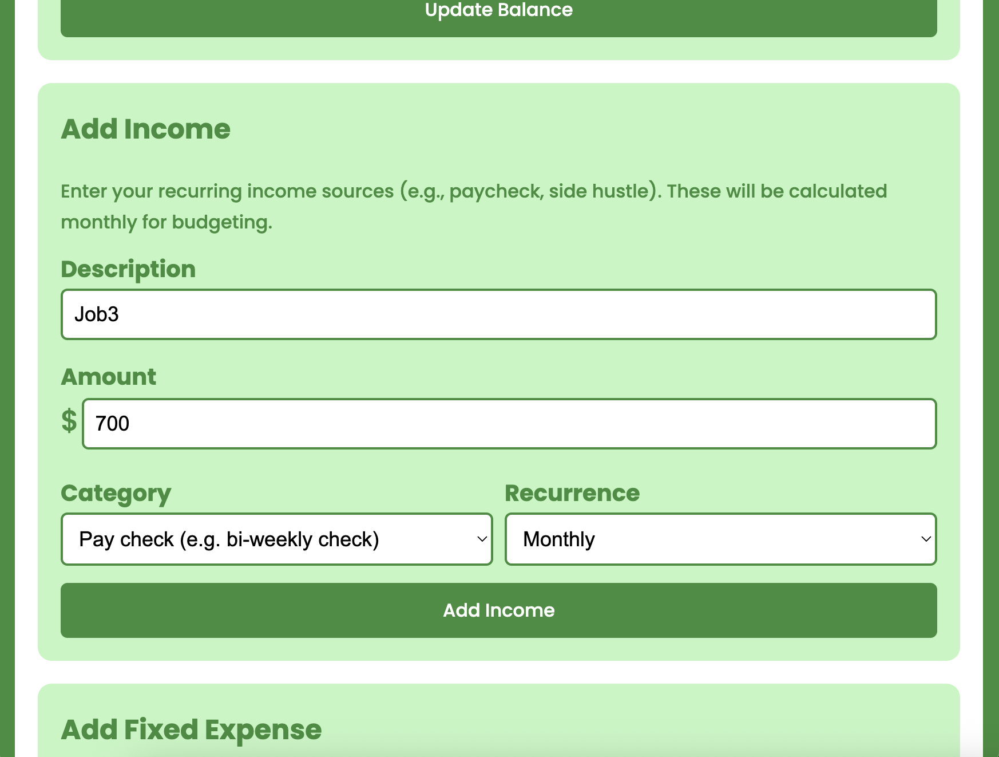
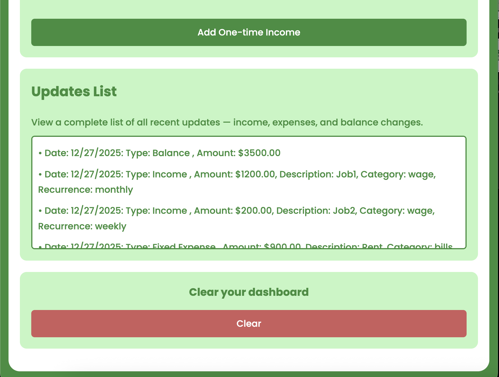
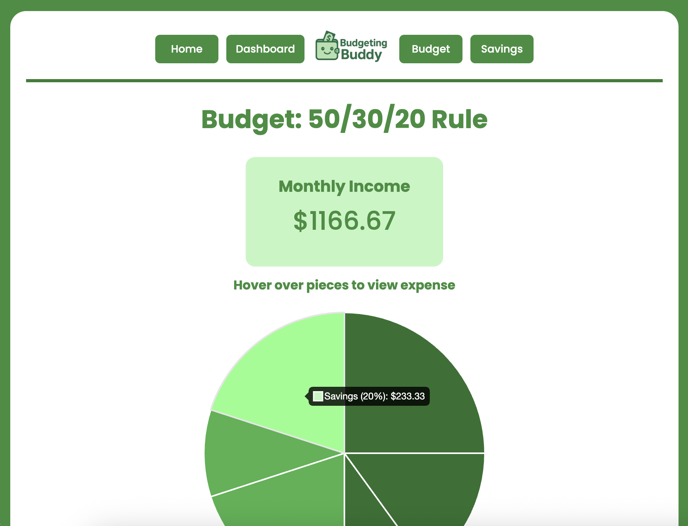
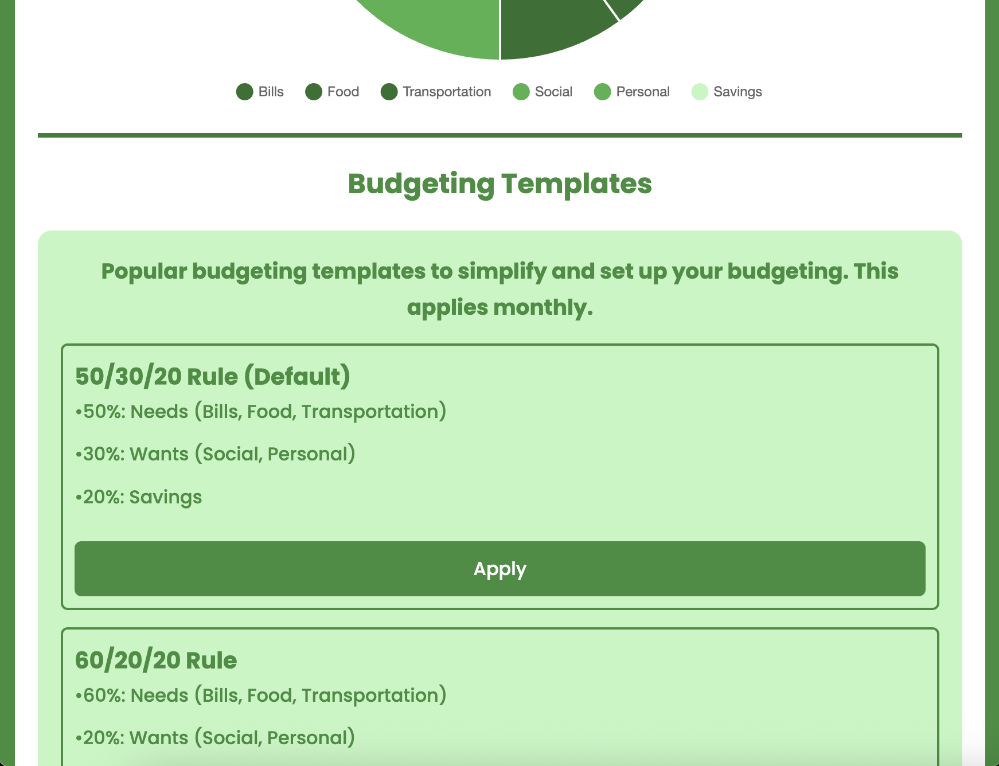
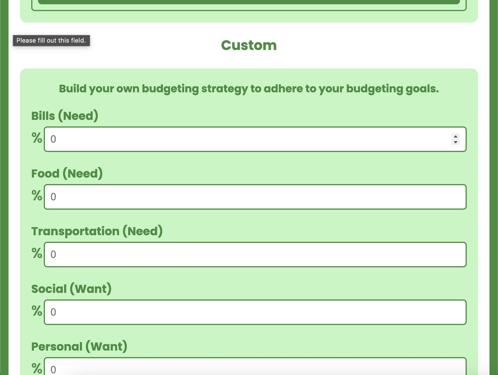
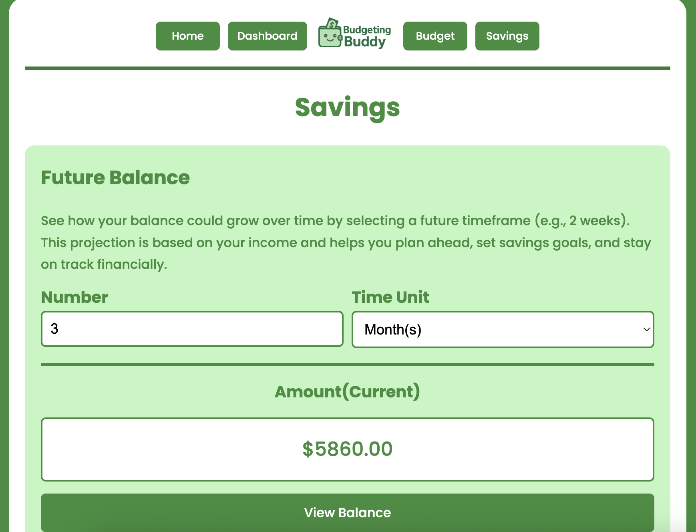

# Budgeting Buddy

A comprehensive personal finance web application for tracking expenses, managing budgets, and planning your financial future. Built as a practical tool for managing personal finances.

## Features

### Dashboard 
- **Balance Tracking** - Monitor account balance with color-coded indicators
- **Income Management** - Track recurring income sources (salary, side hustles, passive income)
- **Expense Categorization** - Seperate fixed and flexible expenses for better budgeting.
- **Transaction Logging** - Record one-time purchases and income for an accurate balance
- **Updates History** - View all of your activities in chronological order

### Budget Planner
- **Pre-Built Budgeting Templates** - Includes pre-built templates that adhere to popular budgeting strategies.
- **Custom Budgeting Section** - Allows the user to design their own budgeting percentages to adjust to their personal needs.
- **Interactive Visualizations** - Interactive Chart.js pie chart, showing budget breakdown with dollar amounts

### Savings Calculator
- **Future Balance Projections** - A fun tool to calculate your balance over time (weeks, months, years)

## Screenshots
### Dashboard Page

*The main Dashboard page, containing the different cards.*

*The "Add Income" input form section.*

*The list of the updates.*

### Budgeting Page

*The top of the Budgeting Page, displying the income after fixed expenses and the pi chart.*

*The section for choosing from the budgeting templates.*

*The custom budgeting template section.*

### Savings Page

*The savings calculator page.*

## How to Use

### 1. Clone or Download the Repository
```bash
git clone https://github.com/yourusername/budgeting-buddy.git
cd budgeting-buddy
```

### 2. Open the Application

Simply open `index.html` in your web browser. No installation or server setup required!
```bash
# Using your default browser
open index.html

# Or for Windows
start index.html
```

## Tech Stach
- **HTML5** - Structure and content
- **CSS3** - Styling and responsive design
- **Vanilla JavaScript** - Application logic and interactivity
- **Chart.js** - Interactive budget pie chart visualization
- **SessionStorage** - Data persistence across pages
